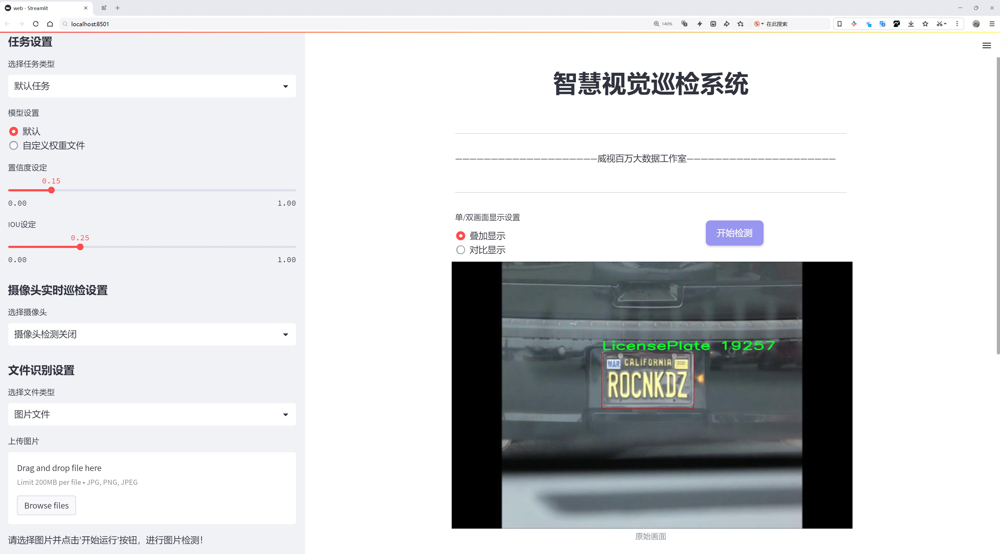
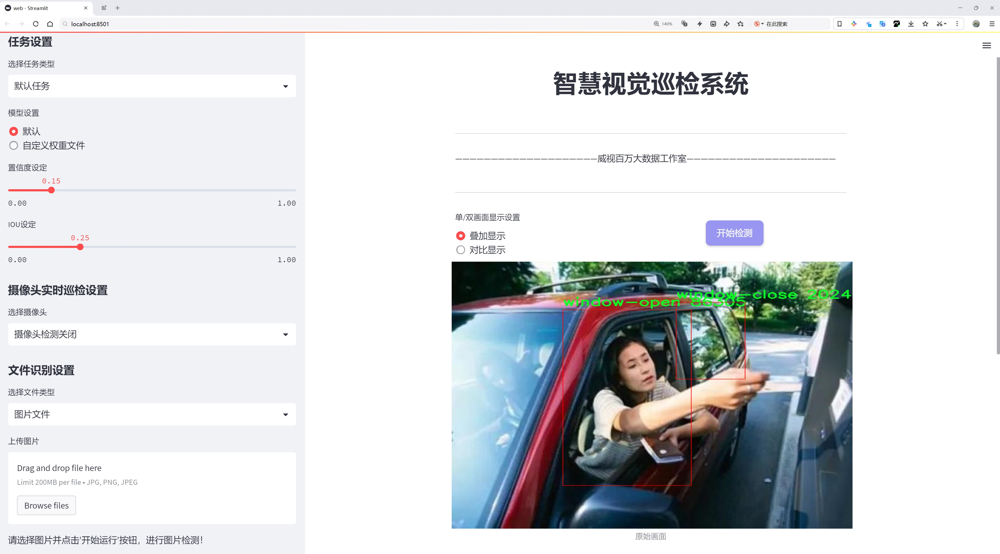
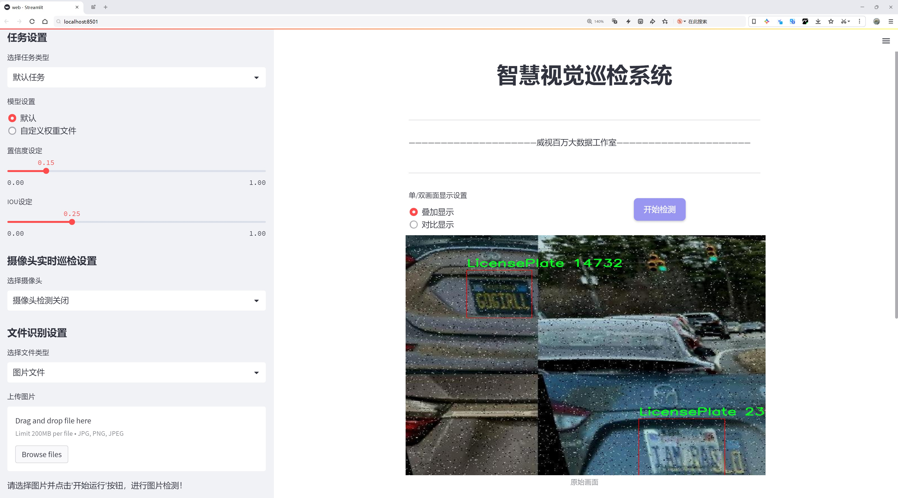
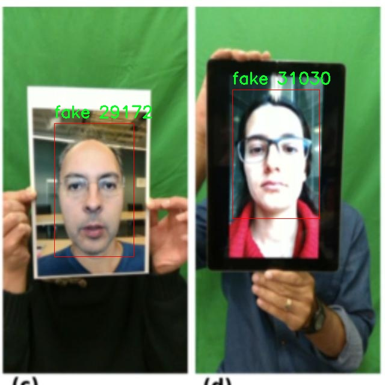
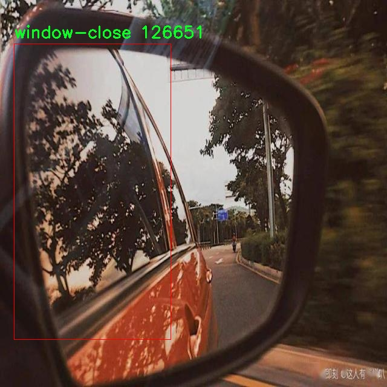
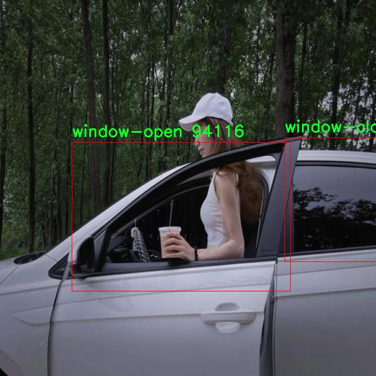
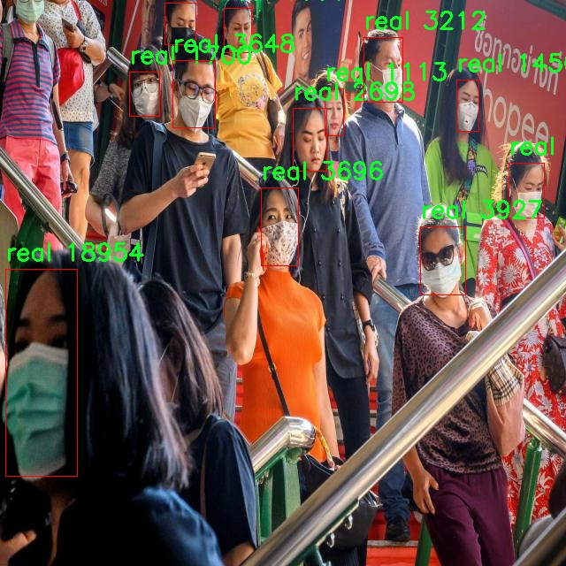

# 智慧交通执法巡检检测系统源码分享
 # [一条龙教学YOLOV8标注好的数据集一键训练_70+全套改进创新点发刊_Web前端展示]

### 1.研究背景与意义

项目参考[AAAI Association for the Advancement of Artificial Intelligence](https://gitee.com/qunmasj/projects)

项目来源[AACV Association for the Advancement of Computer Vision](https://github.com/qunshansj/good)

研究背景与意义

随着城市化进程的加快，交通管理面临着日益严峻的挑战。交通违法行为的频发不仅影响了城市的交通秩序，也对公众的安全和生活质量造成了负面影响。因此，如何高效、准确地进行交通执法巡检，成为了城市管理者亟待解决的问题。传统的交通执法手段往往依赖人工巡查，效率低下且容易受到人为因素的影响，难以实现实时监控和数据分析。近年来，随着计算机视觉和深度学习技术的迅猛发展，基于智能算法的交通执法系统逐渐成为研究热点。

YOLO（You Only Look Once）系列模型以其高效的目标检测能力，广泛应用于各类视觉识别任务中。YOLOv8作为该系列的最新版本，进一步提升了检测精度和速度，具备了更强的实时处理能力。基于YOLOv8的智慧交通执法巡检系统，能够通过对交通场景的实时监控，自动识别和分类交通违法行为，极大地提高了执法效率和准确性。本研究旨在构建一个基于改进YOLOv8的智慧交通执法巡检系统，以实现对交通违法行为的智能识别和自动化处理。

在本研究中，我们将使用名为“ForUni”的数据集，该数据集包含2932张图像，涵盖了7个类别，包括车牌、假牌、无牌、真牌、窗户关闭、窗户中间和窗户打开等。这些类别的设置不仅反映了交通执法中的关键要素，也为模型的训练提供了丰富的样本数据。通过对这些图像的分析和处理，系统能够识别出不同类型的车辆及其状态，从而为交通执法提供可靠的数据支持。

研究的意义在于，通过改进YOLOv8模型，提升其在复杂交通环境下的检测能力，使其能够在各种光照、天气和视角条件下，依然保持高效的识别性能。这不仅有助于减少交通违法行为的发生，还能为交通管理部门提供科学的决策依据，推动智慧交通的建设。此外，基于深度学习的自动化执法系统，能够有效减轻执法人员的工作负担，使其能够将更多精力投入到其他重要的交通管理工作中。

综上所述，基于改进YOLOv8的智慧交通执法巡检系统的研究，不仅具有重要的理论价值，还有着广泛的应用前景。通过该系统的实施，可以实现对交通违法行为的实时监控和智能处理，为城市交通管理提供新的解决方案，促进城市交通的安全与畅通。这一研究不仅为交通执法的智能化发展提供了技术支持，也为未来的智慧城市建设奠定了基础。

### 2.图片演示







##### 注意：由于此博客编辑较早，上面“2.图片演示”和“3.视频演示”展示的系统图片或者视频可能为老版本，新版本在老版本的基础上升级如下：（实际效果以升级的新版本为准）

  （1）适配了YOLOV8的“目标检测”模型和“实例分割”模型，通过加载相应的权重（.pt）文件即可自适应加载模型。

  （2）支持“图片识别”、“视频识别”、“摄像头实时识别”三种识别模式。

  （3）支持“图片识别”、“视频识别”、“摄像头实时识别”三种识别结果保存导出，解决手动导出（容易卡顿出现爆内存）存在的问题，识别完自动保存结果并导出到tempDir中。

  （4）支持Web前端系统中的标题、背景图等自定义修改，后面提供修改教程。

  另外本项目提供训练的数据集和训练教程,暂不提供权重文件（best.pt）,需要您按照教程进行训练后实现图片演示和Web前端界面演示的效果。

### 3.视频演示

[3.1 视频演示](https://www.bilibili.com/video/BV1GKHKeSEGj/?vd_source=ff015de2d29cbe2a9cdbfa7064407a08)

### 4.数据集信息展示

数据集信息展示

在智慧交通执法巡检系统的研究与开发中，数据集的质量和多样性至关重要。本次研究所使用的数据集名为“ForUni”，其主要目标是通过改进YOLOv8模型，提升交通执法巡检的智能化水平。该数据集包含了2932幅图像，涵盖了七个不同的类别，具体包括：车牌（LicensePlate）、假牌（fake）、无牌（null）、真牌（real）、窗户关闭（window-close）、窗户中间（window-mid）以及窗户打开（window-open）。这些类别的设计旨在全面覆盖交通执法中可能遇到的各种场景与情况，确保模型在实际应用中的准确性和鲁棒性。

在数据集的构建过程中，研究团队特别注重图像的多样性与代表性，以确保模型能够适应不同的环境与条件。每个类别的图像均经过精心挑选，力求在不同的光照、天气、角度等情况下，仍能保持较高的识别率。例如，车牌类别的图像不仅包括了清晰可见的真实车牌，还涵盖了不同角度、不同光照条件下的车牌图像，以增强模型对车牌识别的适应能力。而假牌、无牌和真牌的分类则帮助模型在实际执法中更好地判断车辆的合法性，提升执法的准确性和效率。

此外，窗户状态的分类（窗户关闭、窗户中间、窗户打开）则是为了进一步丰富模型的应用场景。在交通执法中，车辆的窗户状态可能会影响执法人员的判断，因此对窗户状态的准确识别同样至关重要。通过对这些细节的关注，数据集为模型的训练提供了更为全面的基础，使得最终的智慧交通执法巡检系统能够在复杂的交通环境中进行有效的监测与执法。

该数据集的使用遵循CC BY 4.0的许可证，意味着研究人员可以自由地使用、修改和分发该数据集，只需在使用时给予适当的署名。这种开放的许可协议不仅促进了学术界的合作与交流，也为相关领域的研究提供了丰富的资源支持。

总之，“ForUni”数据集的构建与应用，旨在为智慧交通执法巡检系统的研究提供坚实的数据基础。通过对车牌及窗户状态等多个类别的细致划分，研究团队希望能够训练出一个更加智能、精准的YOLOv8模型，以应对日益复杂的交通管理需求。这一数据集的成功应用，将为未来的交通执法智能化进程奠定重要的基础，推动智慧交通领域的进一步发展与创新。










### 5.全套项目环境部署视频教程（零基础手把手教学）

[5.1 环境部署教程链接（零基础手把手教学）](https://www.ixigua.com/7404473917358506534?logTag=c807d0cbc21c0ef59de5)


[5.2 安装Python虚拟环境创建和依赖库安装视频教程链接（零基础手把手教学）](https://www.ixigua.com/7404474678003106304?logTag=1f1041108cd1f708b01a)

### 6.手把手YOLOV8训练视频教程（零基础小白有手就能学会）

[6.1 环境部署教程链接（零基础手把手教学）](https://www.ixigua.com/7404477157818401292?logTag=d31a2dfd1983c9668658)

### 7.70+种全套YOLOV8创新点代码加载调参视频教程（一键加载写好的改进模型的配置文件）

[7.1 环境部署教程链接（零基础手把手教学）](https://www.ixigua.com/7404478314661806627?logTag=29066f8288e3f4eea3a4)

### 8.70+种全套YOLOV8创新点原理讲解（非科班也可以轻松写刊发刊，V10版本正在科研待更新）

由于篇幅限制，每个创新点的具体原理讲解就不一一展开，具体见下列网址中的创新点对应子项目的技术原理博客网址【Blog】：


[8.1 70+种全套YOLOV8创新点原理讲解链接](https://gitee.com/qunmasj/good)

### 9.系统功能展示（检测对象为举例，实际内容以本项目数据集为准）

图9.1.系统支持检测结果表格显示

  图9.2.系统支持置信度和IOU阈值手动调节

  图9.3.系统支持自定义加载权重文件best.pt(需要你通过步骤5中训练获得)

  图9.4.系统支持摄像头实时识别

  图9.5.系统支持图片识别

  图9.6.系统支持视频识别

  图9.7.系统支持识别结果文件自动保存

  图9.8.系统支持Excel导出检测结果数据


### 10.原始YOLOV8算法原理

原始YOLOv8算法原理

YOLOv8算法是Ultralytics公司在2023年推出的一个重要更新版本，旨在提升目标检测、图像分割和图像分类等任务的性能和灵活性。该算法在前几代YOLO版本的基础上进行了多项创新，特别是在网络结构、损失函数设计和目标检测策略等方面，展现出更高的准确性和更快的推理速度。

首先，YOLOv8的输入处理部分引入了自适应图片缩放技术，以应对不同长宽比的图像输入。默认情况下，YOLOv8接受640x640的图像，但在实际应用中，图像的长宽比往往不一致。为了解决这一问题，YOLOv8在推理时将图像的长边按比例缩小到指定尺寸，然后对短边进行填充。这种方法不仅减少了填充区域的冗余信息，还提高了目标检测的速度和准确性。此外，在模型训练阶段，YOLOv8采用了Mosaic图像增强技术，通过随机选择四张图像进行缩放和拼接，生成新的训练样本。这种增强策略迫使模型学习不同位置和周围像素的特征，从而有效提升了模型的预测精度。

在网络结构方面，YOLOv8的主干网络（Backbone）采用了C2F模块，取代了YOLOv5中的C3模块。C2F模块的设计灵感来源于YOLOv7中的ELAN模块，通过并行更多的梯度流分支，能够在保持轻量化的同时，获取更丰富的梯度信息。这种结构的改进使得YOLOv8在特征提取的过程中，能够更好地捕捉不同尺度的特征，从而提高了检测精度。

YOLOv8的Neck部分同样进行了重要的结构调整。与YOLOv5相比，YOLOv8去除了两次上采样之前的1x1卷积连接层，直接对Backbone不同阶段输出的特征进行上采样。这一变化简化了网络结构，提高了特征融合的效率，使得模型在处理复杂场景时能够更快速地聚合信息。

在Head部分，YOLOv8实现了从Coupled-Head（耦合头）到Decoupled-Head（解耦头）的转变。这一变化使得检测和分类的卷积过程相互独立，输入特征图首先通过两个1x1卷积模块进行降维，然后分别进行类别预测和边界框位置预测。这种解耦设计不仅提高了模型的灵活性，还增强了其在不同任务中的适应能力。此外，YOLOv8在损失函数的设计上也进行了创新，取消了Obj分支，改为在分类分支中使用二值交叉熵损失（BCELoss），而在边界框回归分支中则采用了分布焦点损失（DFL）和CIoU损失。这种设计旨在加速模型对标签附近数值的聚焦，提高了模型的收敛速度和预测精度。

YOLOv8还抛弃了传统的Anchor-Based（基于锚框）方法，转而采用Anchor-Free（无锚框）策略。这一转变使得目标检测的过程更加灵活，模型不再依赖于预设的锚框进行检测，而是将目标检测问题转化为关键点检测。这种方法不仅简化了网络结构，还提高了模型的泛化能力，尤其在处理多样化的目标时表现得更加出色。

YOLOv8的轻量化版本YOLOv8n，进一步优化了网络结构，通过使用更轻量化的C2F模块替代C3模块，并在特征融合层减少降采样层，显著提升了模型的效率。在特征融合网络中，YOLOv8n引入了BiFPN（双向特征金字塔网络），实现了高效的跨尺度连接和加权特征融合。这一设计不仅加快了不同尺度特征信息的提取速度，还提升了模型在多尺度目标检测中的表现。

综上所述，YOLOv8算法通过一系列结构上的创新和优化，显著提升了目标检测的精度和速度。其自适应输入处理、改进的主干网络、简化的特征融合层以及解耦的检测头设计，使得YOLOv8在实时检测领域达到了新的高度。这些特性使得YOLOv8在各种应用场景中，尤其是在需要快速响应和高准确度的任务中，展现出强大的竞争力。随着YOLOv8的广泛应用，目标检测技术将迎来新的发展机遇，为各行各业带来更高效的解决方案。


### 11.项目核心源码讲解（再也不用担心看不懂代码逻辑）

#### 11.1 ui.py

以下是代码的核心部分，并附上详细的中文注释：

```python
import sys
import subprocess

def run_script(script_path):
    """
    使用当前 Python 环境运行指定的脚本。

    Args:
        script_path (str): 要运行的脚本路径

    Returns:
        None
    """
    # 获取当前 Python 解释器的路径
    python_path = sys.executable

    # 构建运行命令，使用 streamlit 运行指定的脚本
    command = f'"{python_path}" -m streamlit run "{script_path}"'

    # 执行命令，并等待其完成
    result = subprocess.run(command, shell=True)
    
    # 检查命令执行结果，如果返回码不为0，则表示出错
    if result.returncode != 0:
        print("脚本运行出错。")

# 主程序入口
if __name__ == "__main__":
    # 指定要运行的脚本路径
    script_path = "web.py"  # 假设脚本在当前目录下

    # 调用函数运行指定的脚本
    run_script(script_path)
```

### 代码分析与注释：

1. **导入模块**：
   - `import sys`：用于访问与 Python 解释器相关的变量和函数。
   - `import subprocess`：用于执行外部命令。

2. **定义 `run_script` 函数**：
   - 该函数接受一个参数 `script_path`，表示要运行的 Python 脚本的路径。
   - 使用 `sys.executable` 获取当前 Python 解释器的路径，以确保脚本在正确的环境中运行。
   - 构建命令字符串，使用 `streamlit` 模块运行指定的脚本。
   - 使用 `subprocess.run` 执行构建的命令，并等待其完成。
   - 检查命令的返回码，如果返回码不为0，表示脚本运行出错，打印错误信息。

3. **主程序入口**：
   - 使用 `if __name__ == "__main__":` 确保该代码块仅在直接运行脚本时执行，而不是在被导入时执行。
   - 指定要运行的脚本路径为 `web.py`，可以根据需要修改。
   - 调用 `run_script` 函数，传入脚本路径以执行该脚本。 

这个代码的核心功能是通过当前 Python 环境运行指定的 `streamlit` 脚本，并处理可能的错误。

这个文件名为 `ui.py`，它的主要功能是运行一个指定的 Python 脚本，具体来说是通过 Streamlit 框架来启动一个 Web 应用。

首先，文件导入了几个必要的模块，包括 `sys`、`os` 和 `subprocess`。其中，`sys` 模块用于访问与 Python 解释器相关的变量和函数，`os` 模块提供了与操作系统交互的功能，而 `subprocess` 模块则用于创建新进程、连接到它们的输入/输出/错误管道，并获取它们的返回码。

接下来，文件中定义了一个名为 `run_script` 的函数，该函数接受一个参数 `script_path`，表示要运行的脚本的路径。在函数内部，首先获取当前 Python 解释器的路径，这通过 `sys.executable` 实现。然后，构建一个命令字符串，该命令使用当前的 Python 解释器和 Streamlit 模块来运行指定的脚本。具体的命令格式为 `"{python_path}" -m streamlit run "{script_path}"`。

接着，使用 `subprocess.run` 方法执行构建好的命令。该方法的 `shell=True` 参数表示在 shell 中执行命令。执行完命令后，检查返回码 `result.returncode`，如果返回码不为 0，表示脚本运行出错，此时会打印出错误信息。

在文件的最后部分，使用 `if __name__ == "__main__":` 语句来确保只有在直接运行该脚本时才会执行后面的代码。在这里，首先调用 `abs_path` 函数（假设它在 `QtFusion.path` 模块中定义）来获取 `web.py` 脚本的绝对路径。然后，调用 `run_script` 函数来运行这个脚本。

总体而言，这个 `ui.py` 文件的功能是通过 Streamlit 框架来启动一个 Web 应用，且具备基本的错误处理机制。

#### 11.2 utils.py

以下是经过简化和注释的核心代码部分：

```python
import os
import cv2
import pandas as pd
import streamlit as st
from PIL import Image
from QtFusion.path import abs_path

def save_uploaded_file(uploaded_file):
    """
    保存上传的文件到服务器上。

    Args:
        uploaded_file (UploadedFile): 通过Streamlit上传的文件。

    Returns:
        str: 保存文件的完整路径，如果没有文件上传则返回 None。
    """
    # 检查是否有文件上传
    if uploaded_file is not None:
        base_path = "tempDir"  # 定义文件保存的基本路径

        # 如果路径不存在，创建这个路径
        if not os.path.exists(base_path):
            os.makedirs(base_path)
        
        # 获取文件的完整路径
        file_path = os.path.join(base_path, uploaded_file.name)

        # 以二进制写模式打开文件并写入内容
        with open(file_path, "wb") as f:
            f.write(uploaded_file.getbuffer())  # 将上传的文件内容写入到指定路径

        return file_path  # 返回文件路径

    return None  # 如果没有文件上传，返回 None


def concat_results(result, location, confidence, time):
    """
    显示检测结果。

    Args:
        result (str): 检测结果。
        location (str): 检测位置。
        confidence (str): 置信度。
        time (str): 检测用时。

    Returns:
        DataFrame: 包含检测结果的 DataFrame。
    """
    # 创建一个包含检测信息的字典
    result_data = {
        "识别结果": [result],
        "位置": [location],
        "置信度": [confidence],
        "用时": [time]
    }

    # 将字典转换为 DataFrame
    results_df = pd.DataFrame(result_data)
    return results_df


def get_camera_names():
    """
    获取可用摄像头名称列表。

    Returns:
        list: 返回包含“未启用摄像头”和可用摄像头索引号的列表。
    """
    camera_names = ["摄像头检测关闭", "0"]  # 初始化摄像头名称列表
    max_test_cameras = 10  # 定义要测试的最大摄像头数量

    # 测试摄像头索引
    for i in range(max_test_cameras):
        cap = cv2.VideoCapture(i, cv2.CAP_DSHOW)  # 尝试打开摄像头
        if cap.isOpened() and str(i) not in camera_names:  # 如果摄像头打开成功
            camera_names.append(str(i))  # 添加摄像头索引到列表
            cap.release()  # 释放摄像头资源
    
    # 如果没有找到可用的摄像头，输出提示信息
    if len(camera_names) == 1:
        st.write("未找到可用的摄像头")
    
    return camera_names  # 返回摄像头名称列表
```

### 代码说明：
1. **`save_uploaded_file` 函数**：用于保存用户上传的文件到服务器的指定目录。如果没有文件上传，则返回 `None`。
2. **`concat_results` 函数**：将检测结果、位置、置信度和用时等信息整理成一个 Pandas DataFrame，便于后续处理和展示。
3. **`get_camera_names` 函数**：检测系统中可用的摄像头，并返回一个包含摄像头索引的列表。如果没有找到可用的摄像头，则会输出提示信息。

这个程序文件 `utils.py` 包含了一些实用的函数，主要用于处理文件上传、显示检测结果、加载默认图片以及获取可用摄像头的名称。

首先，`save_uploaded_file` 函数用于保存用户通过 Streamlit 上传的文件。它接收一个参数 `uploaded_file`，这个参数是用户上传的文件对象。函数首先检查是否有文件被上传，如果有，则定义一个基本路径 `tempDir` 来保存文件。如果该路径不存在，函数会创建这个目录。接着，函数获取上传文件的完整路径，并以二进制写模式打开文件，将上传的内容写入到指定路径中。最后，函数返回保存文件的完整路径，如果没有文件上传，则返回 `None`。

接下来，`concat_results` 函数用于显示检测结果。它接收四个参数：`result`（检测结果）、`location`（检测位置）、`confidence`（置信度）和 `time`（检测用时）。函数将这些信息组织成一个字典，然后使用 Pandas 创建一个 DataFrame，最后返回这个 DataFrame，以便后续展示或处理。

`load_default_image` 函数用于加载一个默认的图片。它通过调用 `abs_path` 函数获取默认图片的绝对路径，然后使用 PIL 库打开这个图片并返回其对象。

最后，`get_camera_names` 函数用于获取可用摄像头的名称列表。函数首先初始化一个包含“摄像头检测关闭”和默认摄像头索引“0”的列表。然后，函数通过循环测试最多 10 个摄像头的可用性，使用 OpenCV 的 `VideoCapture` 方法来尝试打开每个摄像头。如果成功打开，则将摄像头的索引添加到列表中。最后，如果没有找到可用的摄像头，函数会在 Streamlit 界面上显示相应的提示信息，并返回摄像头名称列表。

整体来看，这个文件提供了一些基础的功能，方便在使用 Streamlit 进行图像处理或摄像头操作时进行文件管理和结果展示。

#### 11.3 ultralytics\models\__init__.py

以下是保留的核心代码部分，并附上详细的中文注释：

```python
# 导入所需的模块
from .rtdetr import RTDETR  # 导入RTDETR类
from .sam import SAM        # 导入SAM类
from .yolo import YOLO      # 导入YOLO类

# 定义可供外部访问的模块内容
__all__ = "YOLO", "RTDETR", "SAM"  # 允许更简单的导入方式
```

### 代码注释说明：

1. **模块导入**：
   - `from .rtdetr import RTDETR`：从当前包的 `rtdetr` 模块中导入 `RTDETR` 类。`RTDETR` 可能是一个用于目标检测的模型。
   - `from .sam import SAM`：从当前包的 `sam` 模块中导入 `SAM` 类。`SAM` 可能是一个与图像分割或处理相关的模型。
   - `from .yolo import YOLO`：从当前包的 `yolo` 模块中导入 `YOLO` 类。`YOLO` 是一种流行的实时目标检测模型。

2. **`__all__` 变量**：
   - `__all__ = "YOLO", "RTDETR", "SAM"`：这个变量定义了当使用 `from module import *` 语句时，哪些名称会被导入。它允许用户更简单地导入这些类，而不需要指定完整的模块路径。

这个程序文件是Ultralytics YOLO项目中的一个初始化文件，通常命名为`__init__.py`，用于将模块组织成一个包。在这个文件中，首先有一个注释，表明该项目是Ultralytics YOLO，使用的是AGPL-3.0许可证。

接下来，文件通过相对导入的方式引入了三个类或模块：`RTDETR`、`SAM`和`YOLO`。这些类或模块分别定义在同一包中的不同文件中。具体来说，`RTDETR`可能与实时目标检测相关，`SAM`可能是某种分割算法，而`YOLO`则是著名的目标检测算法。

最后，`__all__`变量被定义为一个元组，包含了这三个类的名称。这一行的作用是指定当使用`from ultralytics.models import *`这种方式导入时，只有`YOLO`、`RTDETR`和`SAM`这三个名称会被导入。这有助于控制模块的公共接口，避免不必要的名称被导入，从而保持命名空间的整洁。

总的来说，这个文件的主要功能是组织和简化模块的导入，使得用户可以方便地使用YOLO及其相关的功能。

#### 11.4 ultralytics\models\yolo\obb\train.py

以下是经过简化和注释的核心代码部分：

```python
# 导入必要的模块
from copy import copy
from ultralytics.models import yolo
from ultralytics.nn.tasks import OBBModel
from ultralytics.utils import DEFAULT_CFG, RANK

class OBBTrainer(yolo.detect.DetectionTrainer):
    """
    OBBTrainer类扩展了DetectionTrainer类，用于基于定向边界框（OBB）模型的训练。
    """

    def __init__(self, cfg=DEFAULT_CFG, overrides=None, _callbacks=None):
        """初始化OBBTrainer对象，接受配置和重写参数。"""
        if overrides is None:
            overrides = {}
        # 设置任务类型为'obb'
        overrides["task"] = "obb"
        # 调用父类的初始化方法
        super().__init__(cfg, overrides, _callbacks)

    def get_model(self, cfg=None, weights=None, verbose=True):
        """返回使用指定配置和权重初始化的OBBModel模型。"""
        # 创建OBBModel实例，设置输入通道数和类别数
        model = OBBModel(cfg, ch=3, nc=self.data["nc"], verbose=verbose and RANK == -1)
        # 如果提供了权重，则加载权重
        if weights:
            model.load(weights)

        return model

    def get_validator(self):
        """返回用于YOLO模型验证的OBBValidator实例。"""
        # 定义损失名称
        self.loss_names = "box_loss", "cls_loss", "dfl_loss"
        # 返回OBBValidator实例
        return yolo.obb.OBBValidator(self.test_loader, save_dir=self.save_dir, args=copy(self.args))
```

### 代码注释说明：
1. **导入模块**：导入所需的模块和类，包括模型定义和工具函数。
2. **OBBTrainer类**：这是一个用于训练OBB模型的类，继承自YOLO的检测训练器。
3. **初始化方法**：构造函数中设置任务类型为“obb”，并调用父类的初始化方法以完成基本设置。
4. **获取模型方法**：此方法用于创建和返回一个OBB模型实例，可以选择性地加载预训练权重。
5. **获取验证器方法**：返回一个用于验证模型性能的OBBValidator实例，并定义损失名称以便后续分析。

这个程序文件是一个用于训练基于定向边界框（OBB）模型的YOLO（You Only Look Once）框架的实现。它继承自YOLO的检测训练器类，主要功能是配置和执行OBB模型的训练过程。

在文件的开头，首先导入了一些必要的模块和类，包括YOLO模型、OBB模型以及一些实用工具。接着定义了一个名为`OBBTrainer`的类，这个类扩展了`DetectionTrainer`类，专门用于处理OBB模型的训练。

在`OBBTrainer`类的构造函数`__init__`中，首先检查传入的参数`overrides`是否为`None`，如果是，则初始化为空字典。然后将任务类型设置为“obb”，并调用父类的构造函数进行初始化。这一过程确保了OBBTrainer可以正确地配置训练所需的参数。

`get_model`方法用于返回一个初始化的OBB模型。它接受配置和权重作为参数，如果提供了权重，则会加载这些权重。这个方法的返回值是一个配置好的OBB模型实例，可以用于后续的训练过程。

`get_validator`方法则用于返回一个OBB验证器的实例，以便在训练过程中进行模型的验证。它定义了损失名称，包括“box_loss”、“cls_loss”和“dfl_loss”，并创建一个OBBValidator实例，传入测试数据加载器、保存目录以及参数的副本。这使得在训练完成后，可以对模型的性能进行评估。

整体来看，这个文件的主要功能是为OBB模型的训练提供一个结构化的框架，方便用户进行模型的配置、训练和验证。通过示例代码，用户可以快速上手，定义模型、数据集和训练周期，启动训练过程。

#### 11.5 ultralytics\models\yolo\segment\predict.py

以下是经过简化和详细注释的核心代码部分：

```python
# 导入必要的模块和类
from ultralytics.engine.results import Results
from ultralytics.models.yolo.detect.predict import DetectionPredictor
from ultralytics.utils import ops

class SegmentationPredictor(DetectionPredictor):
    """
    SegmentationPredictor类扩展了DetectionPredictor类，用于基于分割模型的预测。
    """

    def __init__(self, cfg=DEFAULT_CFG, overrides=None, _callbacks=None):
        """初始化SegmentationPredictor，设置配置、覆盖参数和回调函数。"""
        super().__init__(cfg, overrides, _callbacks)  # 调用父类构造函数
        self.args.task = "segment"  # 设置任务类型为分割

    def postprocess(self, preds, img, orig_imgs):
        """对每个输入图像应用非极大值抑制，并处理检测结果。"""
        # 应用非极大值抑制，过滤掉低置信度的检测框
        p = ops.non_max_suppression(
            preds[0],  # 预测结果
            self.args.conf,  # 置信度阈值
            self.args.iou,  # IOU阈值
            agnostic=self.args.agnostic_nms,  # 是否使用类别无关的NMS
            max_det=self.args.max_det,  # 最大检测框数量
            nc=len(self.model.names),  # 类别数量
            classes=self.args.classes,  # 选择的类别
        )

        # 如果输入图像不是列表，则将其转换为numpy数组
        if not isinstance(orig_imgs, list):
            orig_imgs = ops.convert_torch2numpy_batch(orig_imgs)

        results = []  # 存储结果的列表
        proto = preds[1][-1] if len(preds[1]) == 3 else preds[1]  # 获取掩膜原型

        # 遍历每个预测结果
        for i, pred in enumerate(p):
            orig_img = orig_imgs[i]  # 获取原始图像
            img_path = self.batch[0][i]  # 获取图像路径

            if not len(pred):  # 如果没有检测到框
                masks = None  # 掩膜设置为None
            elif self.args.retina_masks:  # 如果使用Retina掩膜
                # 调整检测框的坐标
                pred[:, :4] = ops.scale_boxes(img.shape[2:], pred[:, :4], orig_img.shape)
                # 处理掩膜
                masks = ops.process_mask_native(proto[i], pred[:, 6:], pred[:, :4], orig_img.shape[:2])  # HWC
            else:  # 否则使用常规掩膜处理
                masks = ops.process_mask(proto[i], pred[:, 6:], pred[:, :4], img.shape[2:], upsample=True)  # HWC
                # 调整检测框的坐标
                pred[:, :4] = ops.scale_boxes(img.shape[2:], pred[:, :4], orig_img.shape)

            # 将结果存储到Results对象中
            results.append(Results(orig_img, path=img_path, names=self.model.names, boxes=pred[:, :6], masks=masks))

        return results  # 返回处理后的结果
```

### 代码注释说明：
1. **类的定义**：`SegmentationPredictor`类继承自`DetectionPredictor`，用于处理图像分割任务。
2. **构造函数**：初始化时调用父类构造函数，并设置任务类型为“segment”。
3. **后处理函数**：`postprocess`方法对模型的预测结果进行处理，包括应用非极大值抑制（NMS）和掩膜处理。
4. **非极大值抑制**：通过设置置信度和IOU阈值来过滤低质量的检测框。
5. **掩膜处理**：根据是否使用Retina掩膜来选择不同的掩膜处理方式，并调整检测框的坐标。
6. **结果存储**：将处理后的结果存储在`Results`对象中，并返回。

这个程序文件是Ultralytics YOLO模型中的一个用于图像分割预测的类，名为`SegmentationPredictor`。它继承自`DetectionPredictor`类，主要用于基于分割模型进行预测。

在文件的开头，导入了一些必要的模块和类，包括`Results`、`DetectionPredictor`和一些工具函数。接着，定义了`SegmentationPredictor`类，并在类文档字符串中提供了使用示例，说明如何创建一个预测器实例并调用其预测功能。

`SegmentationPredictor`类的构造函数`__init__`接受三个参数：`cfg`（配置），`overrides`（覆盖参数），和`_callbacks`（回调函数）。在构造函数中，调用了父类的构造函数，并将任务类型设置为“segment”，表明这是一个分割任务的预测器。

`postprocess`方法是该类的核心功能之一，负责对模型的预测结果进行后处理。该方法接受三个参数：`preds`（预测结果）、`img`（输入图像）和`orig_imgs`（原始图像）。首先，它调用`ops.non_max_suppression`函数对预测结果进行非极大值抑制，以过滤掉冗余的检测框。然后，它检查输入的原始图像是否为列表，如果不是，则将其转换为NumPy数组。

接下来，方法会处理每个预测结果。它从预测结果中提取出原始图像和对应的图像路径。如果没有检测到任何物体，则将掩码设置为`None`。如果启用了`retina_masks`选项，则会调用`ops.process_mask_native`函数处理掩码；否则，调用`ops.process_mask`函数进行处理，并对检测框进行缩放，以适应原始图像的尺寸。最后，将处理后的结果封装成`Results`对象，并将其添加到结果列表中。

最终，`postprocess`方法返回一个包含所有处理结果的列表，每个结果包括原始图像、图像路径、模型名称、检测框和掩码。这使得用户可以方便地获取和使用分割模型的预测结果。

#### 11.6 train.py

以下是代码中最核心的部分，并附上详细的中文注释：

```python
import os
import torch
import yaml
from ultralytics import YOLO  # 导入YOLO模型库
from QtFusion.path import abs_path  # 导入获取绝对路径的函数

# 设置设备为GPU（如果可用），否则使用CPU
device = "0" if torch.cuda.is_available() else "cpu"

if __name__ == '__main__':  # 确保该模块被直接运行时才执行以下代码
    workers = 1  # 设置数据加载的工作进程数量
    batch = 2  # 设置每个批次的大小

    data_name = "data"  # 数据集名称
    # 获取数据集yaml文件的绝对路径
    data_path = abs_path(f'datasets/{data_name}/{data_name}.yaml', path_type='current')  
    unix_style_path = data_path.replace(os.sep, '/')  # 将路径转换为Unix风格

    # 获取数据集目录路径
    directory_path = os.path.dirname(unix_style_path)
    
    # 读取YAML文件，保持原有顺序
    with open(data_path, 'r') as file:
        data = yaml.load(file, Loader=yaml.FullLoader)
    
    # 如果YAML文件中有'path'项，则修改为当前目录路径
    if 'path' in data:
        data['path'] = directory_path
        # 将修改后的数据写回YAML文件
        with open(data_path, 'w') as file:
            yaml.safe_dump(data, file, sort_keys=False)

    # 加载预训练的YOLOv8模型
    model = YOLO(model='./ultralytics/cfg/models/v8/yolov8s.yaml', task='detect')  
    
    # 开始训练模型
    results2 = model.train(  
        data=data_path,  # 指定训练数据的配置文件路径
        device=device,  # 指定使用的设备（GPU或CPU）
        workers=workers,  # 指定数据加载的工作进程数量
        imgsz=640,  # 指定输入图像的大小为640x640
        epochs=100,  # 指定训练的轮数为100
        batch=batch,  # 指定每个批次的大小
        name='train_v8_' + data_name  # 指定训练任务的名称
    )
```

### 代码核心部分说明：
1. **设备选择**：通过`torch.cuda.is_available()`判断是否有可用的GPU，如果有则使用GPU，否则使用CPU。
2. **数据集路径处理**：获取数据集的绝对路径，并确保YAML文件中的`path`项指向正确的目录。
3. **模型加载**：使用YOLOv8的配置文件加载预训练模型。
4. **模型训练**：通过`model.train()`方法开始训练，指定训练数据、设备、工作进程、图像大小、训练轮数、批次大小和任务名称等参数。

该程序文件`train.py`主要用于训练YOLOv8目标检测模型。首先，程序导入了必要的库，包括`os`、`torch`、`yaml`和`ultralytics`中的YOLO模型。接着，程序通过检查CUDA是否可用来决定使用GPU还是CPU进行训练。

在`__main__`模块中，程序设置了一些训练参数，如工作进程数和批次大小。接下来，程序定义了数据集的名称，并构建了数据集配置文件的绝对路径。通过`abs_path`函数，程序获取了数据集的路径，并将路径中的分隔符统一为Unix风格。

程序接着获取了数据集目录的路径，并打开指定的YAML文件以读取数据集的配置。读取后，程序检查YAML文件中是否包含`path`项，如果有，则将其修改为数据集的目录路径，并将更新后的内容写回YAML文件，以确保后续训练能够正确找到数据集。

然后，程序加载了YOLOv8模型的配置文件。此处使用的是YOLOv8s的配置文件，模型任务设置为目标检测。接下来，程序调用`model.train()`方法开始训练模型，传入训练所需的参数，包括数据配置文件路径、设备、工作进程数、输入图像大小、训练的epoch数量、批次大小以及训练任务的名称。

整体来看，该程序实现了从数据集路径配置到模型训练的完整流程，适合用于YOLOv8模型的目标检测任务。

### 12.系统整体结构（节选）

### 程序整体功能和构架概括

该程序是一个基于Ultralytics YOLO框架的计算机视觉项目，主要用于目标检测、图像分割和分类等任务。整体架构包括多个模块和文件，每个文件负责特定的功能，从用户界面到模型训练和预测，形成一个完整的工作流。

- **用户界面（UI）**：通过`ui.py`文件提供用户交互界面，允许用户上传文件、查看检测结果等。
- **实用工具（Utils）**：`utils.py`文件提供了一些辅助函数，如文件保存、结果展示、默认图片加载和摄像头检测等。
- **模型管理**：`__init__.py`文件组织了不同的YOLO模型（如RTDETR、SAM和YOLO），使得用户可以方便地导入和使用这些模型。
- **训练模块**：`train.py`文件负责模型的训练过程，配置数据集、模型参数，并启动训练。
- **预测模块**：多个预测文件（如`predict.py`）负责处理不同任务的预测，包括目标检测、图像分割等。

### 文件功能整理表

| 文件路径                                      | 功能描述                                                                                     |
|-------------------------------------------|------------------------------------------------------------------------------------------|
| `ui.py`                                   | 提供用户界面，允许用户上传文件并查看检测结果。                                                        |
| `utils.py`                                | 包含实用工具函数，如文件上传、结果展示、加载默认图片和获取可用摄像头名称。                               |
| `ultralytics/models/__init__.py`         | 组织YOLO模型，方便用户导入RTDETR、SAM和YOLO等模型。                                           |
| `ultralytics/models/yolo/obb/train.py`   | 负责OBB模型的训练，配置模型参数并执行训练过程。                                                |
| `ultralytics/models/yolo/segment/predict.py` | 处理图像分割任务的预测，后处理模型输出并返回结果。                                               |
| `train.py`                                | 负责YOLOv8模型的训练，配置数据集和模型参数，并启动训练过程。                                    |
| `ultralytics/models/fastsam/prompt.py`   | 提供与FastSAM模型相关的功能，可能涉及到交互式提示或输入处理（具体功能需查看代码）。                   |
| `ultralytics/models/yolo/classify/__init__.py` | 组织YOLO分类模型，便于用户导入和使用分类相关功能。                                              |
| `ultralytics/models/yolo/detect/predict.py` | 处理目标检测任务的预测，后处理模型输出并返回检测结果。                                          |
| `ultralytics/models/yolo/pose/__init__.py` | 组织YOLO姿态估计模型，便于用户导入和使用姿态估计相关功能。                                      |

以上表格概述了每个文件的主要功能，帮助理解程序的整体架构和模块化设计。

注意：由于此博客编辑较早，上面“11.项目核心源码讲解（再也不用担心看不懂代码逻辑）”中部分代码可能会优化升级，仅供参考学习，完整“训练源码”、“Web前端界面”和“70+种创新点源码”以“13.完整训练+Web前端界面+70+种创新点源码、数据集获取”的内容为准。

### 13.完整训练+Web前端界面+70+种创新点源码、数据集获取


https://mbd.pub/o/bread/ZpqXkppq